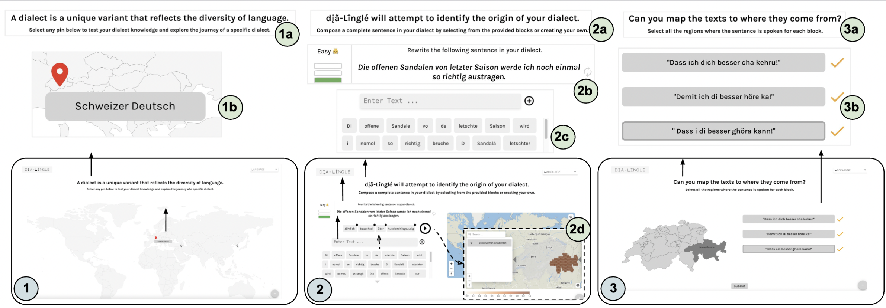
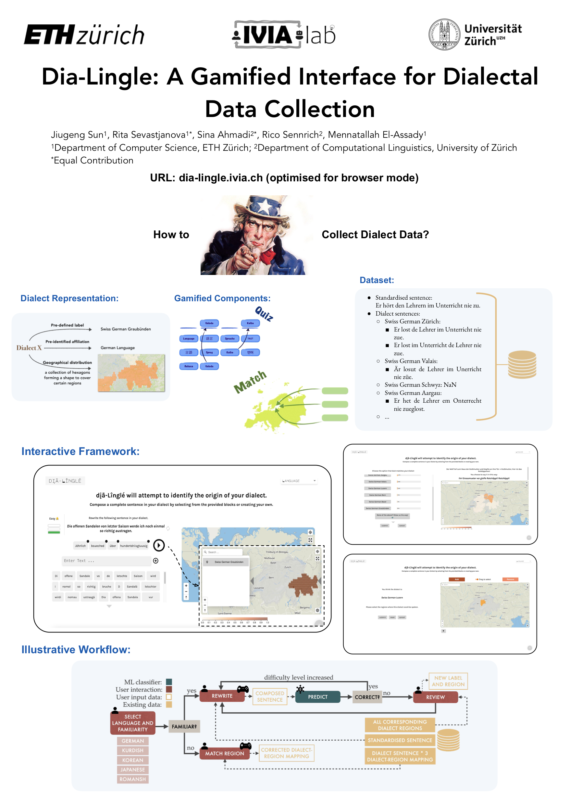

<!--Include academic icons or bottons-->



## Abstract

Dialects suffer from the scarcity of computational textual resources as they exist predominantly in spoken rather than written form and exhibit remarkable geographical diversity. 
Collecting dialect data and subsequently integrating it into current language technologies present significant obstacles. 
Gamification has been proven to facilitate remote data collection processes with great ease and on a substantially wider scale. 
This paper introduces Dia-Lingle, a gamified interface aimed to improve and facilitate dialectal data collection tasks such as corpus expansion and dialect labelling. 
The platform features two key components: the first challenges users to rewrite sentences in their dialects, identifies them through a classifier and solicits feedback, and the other one asks users to match sentences to their geographical locations. 
Dia-Lingle combines active learning with gamified difficulty levels, strategically encouraging prolonged user engagement while efficiently enriching the dialect corpus. Usability evaluation shows that our interface demonstrates high levels of user satisfaction. 
We provide the link to Dia-Lingle: [https://dia-lingle.ivia.ch/](https://dia-lingle.ivia.ch/), and demo video: [https://youtu.be/0QyJsB8ym64](https://youtu.be/0QyJsB8ym64).

## Links

Published [paper](https://aclanthology.org/2025.acl-demo.15/) on 63rd Annual Meeting of the Association for Computational Linguistics (ACL). 

## Poster

