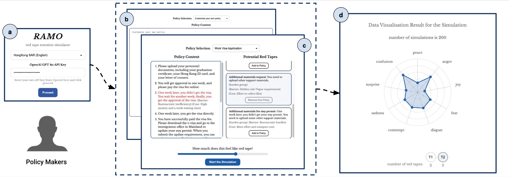



Read the full paper on **[arXiv](https://arxiv.org/abs/2604.12545)** ([PDF](https://arxiv.org/pdf/2604.12545.pdf)) · DOI [10.48550/arXiv.2604.12545](https://doi.org/10.48550/arXiv.2604.12545) · Demo **[RAMO](https://ramo-chi.ivia.ch/)** (red tape emotional response simulator)

## Abstract

Improving policymaking is a central concern in public administration. Prior human subject studies reveal substantial cross-cultural differences in citizens' emotional responses to red tape during policy implementation. While LLM agents offer opportunities to simulate human-like responses and reduce experimental costs, their ability to generate culturally appropriate emotional responses to red tape remains unverified. To address this gap, we propose an evaluation framework for assessing LLMs' emotional responses to red tape across diverse cultural contexts. As a pilot study, we apply this framework to a single red-tape scenario. Our results show that all models exhibit limited alignment with human emotional responses, with notably weaker performance in Eastern cultures. Cultural prompting strategies prove largely ineffective in improving alignment. We further introduce **RAMO**, an interactive interface for simulating citizens' emotional responses to red tape and for collecting human data to improve models. The interface is publicly available at [https://ramo-chi.ivia.ch](https://ramo-chi.ivia.ch/).

## Links

- [arXiv](https://arxiv.org/abs/2604.12545)
- [arXiv PDF](https://arxiv.org/pdf/2604.12545.pdf)
- [RAMO live demo](https://ramo-chi.ivia.ch/)
