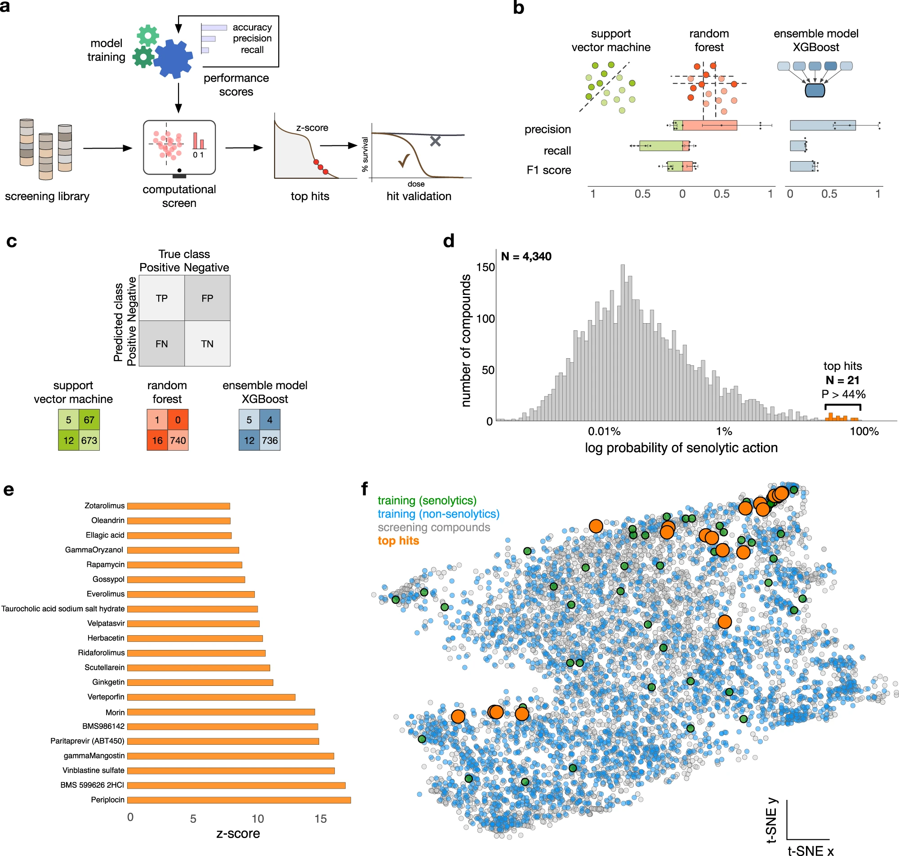

<!--Include academic icons or buttons-->




## Abstract

Cellular senescence is a stress response involved in ageing and diverse disease processes including cancer, type-2 diabetes, osteoarthritis and viral infection. Despite growing interest in targeted elimination of senescent cells, 
only few senolytics are known due to the lack of well-characterised molecular targets. Here, we report the discovery of three senolytics using cost-effective machine learning algorithms trained solely on published data. 
We computationally screened various chemical libraries and validated the senolytic action of ginkgetin, periplocin and oleandrin in human cell lines under various modalities of senescence. 
The compounds have potency comparable to known senolytics, and we show that oleandrin has improved potency over its target as compared to best-in-class alternatives. 
Our approach led to several hundred-fold reduction in drug screening costs and demonstrates that artificial intelligence can take maximum advantage of small and heterogeneous drug screening data, paving the way for new open science approaches to early-stage drug discovery.

## Links

Published [paper](https://www.nature.com/articles/s41467-023-39120-1.pdf) on Nature Communications. 

```{=html}
<script type="text/javascript" src="https://d1bxh8uas1mnw7.cloudfront.net/assets/embed.js"></script><div class="altmetric-embed" data-badge-popover="right" data-badge-type="donut" data-doi="10.1038/s41467-023-39120-1"></div>

<span class="__dimensions_badge_embed__" data-doi="10.1038/s41467-023-39120-1" data-hide-zero-citations="true" data-style="small_circle"></span><script async src="https://badge.dimensions.ai/badge.js" charset="utf-8"></script>
```