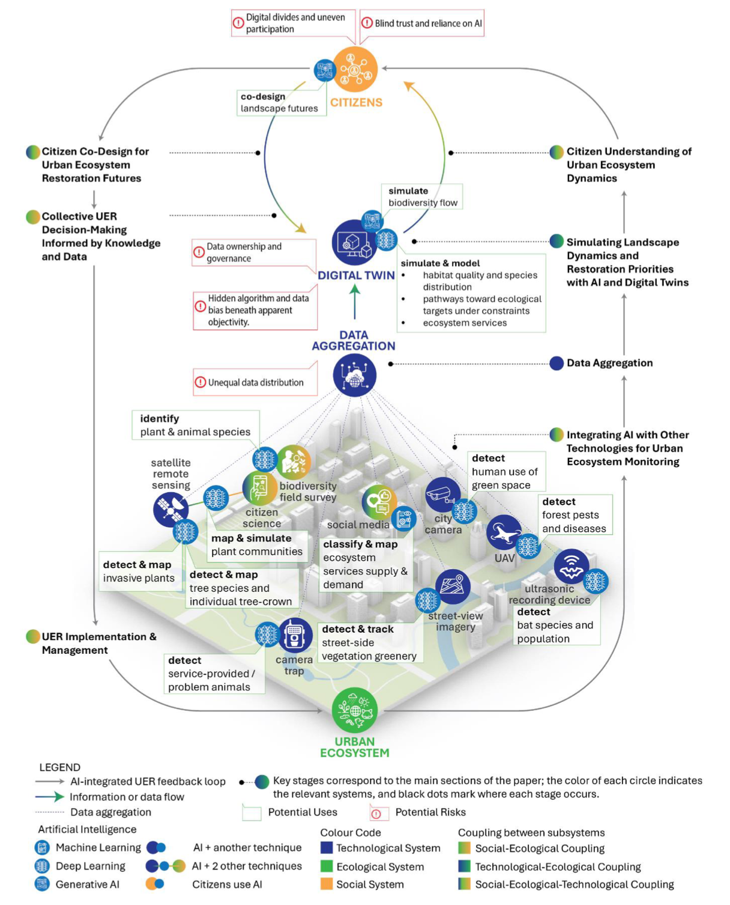

<!--Include academic icons or buttons-->




## Abstract

Ecosystem functioning enabled by urban ecosystem restoration (UER) contributes to sustainable cities. We examine how artificial intelligence (AI) supports integrated UER approaches by linking monitoring, simulation, and participatory processes within a social–ecological–technological systems framework, forming an AI-integrated UER feedback cycle. AI can contribute to social-ecological monitoring, multisource data integration, landscape simulation, citizen understanding, co-design, and adaptive management in UER under expert oversight and with attention to associated risks.

## Links

Published [paper](https://www.nature.com/articles/s42949-026-00453-7) on npj Urban Sustainability.

```{=html}
<script type="text/javascript" src="https://d1bxh8uas1mnw7.cloudfront.net/assets/embed.js"></script><div class="altmetric-embed" data-badge-popover="right" data-badge-type="donut" data-doi="10.1038/s42949-026-00453-7"></div>

<span class="__dimensions_badge_embed__" data-doi="10.1038/s42949-026-00453-7" data-hide-zero-citations="true" data-style="small_circle"></span><script async src="https://badge.dimensions.ai/badge.js" charset="utf-8"></script>
```
